Part 1. Настройка gitlab-runner

1. Установка Ubuntu Server 20.04 LTS
2. Установка gitlab-runner
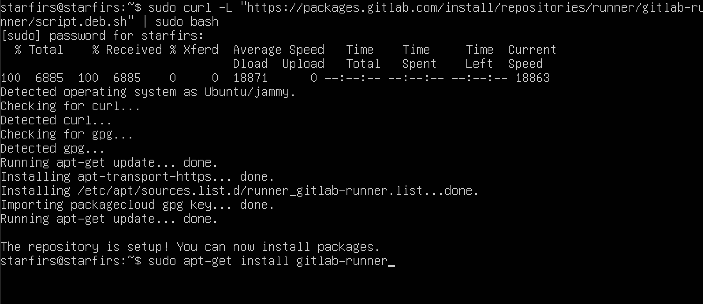

3. Регистрация пользователя в gitlab-runner
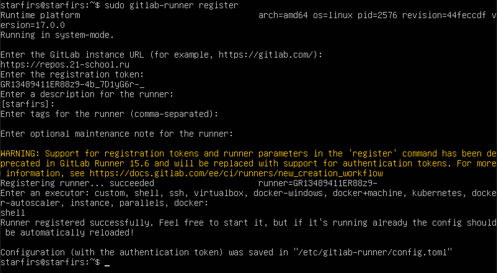

Part 2. Сборка

1. Этап CI для сборки проекта
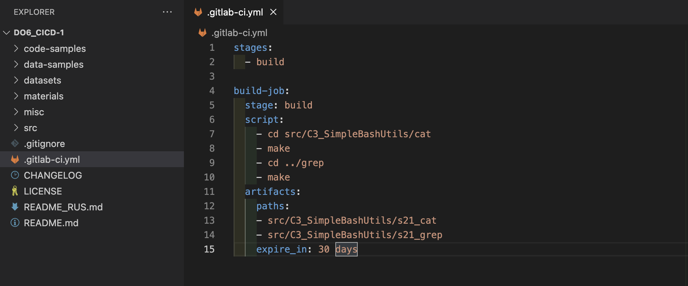

2. Результат сборки проекта
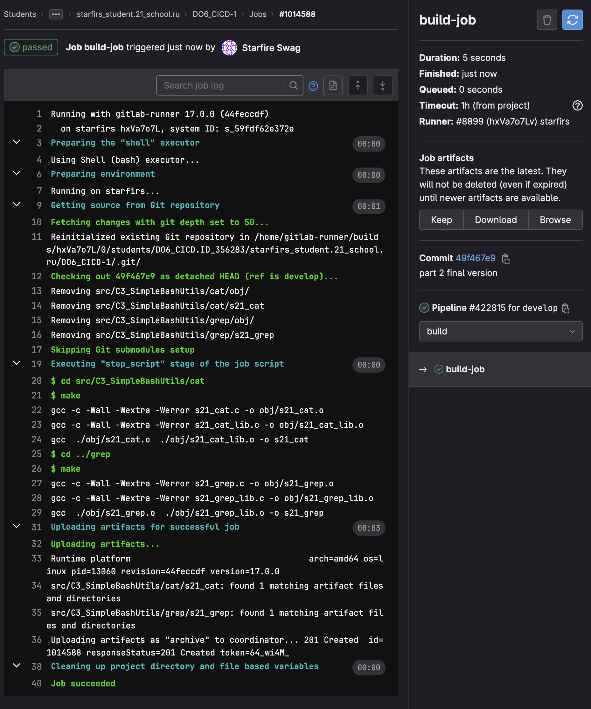

Part 3. Тест кодстайла

1. Cкрипт который будет проверять кодстайл проекта
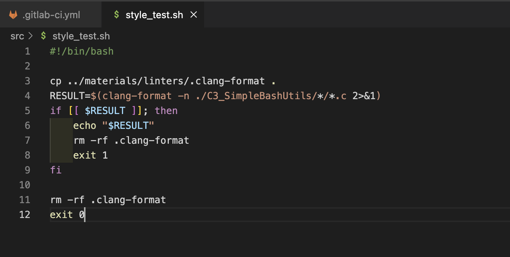

2. Этап CI в файле .gitlab-ci.yml
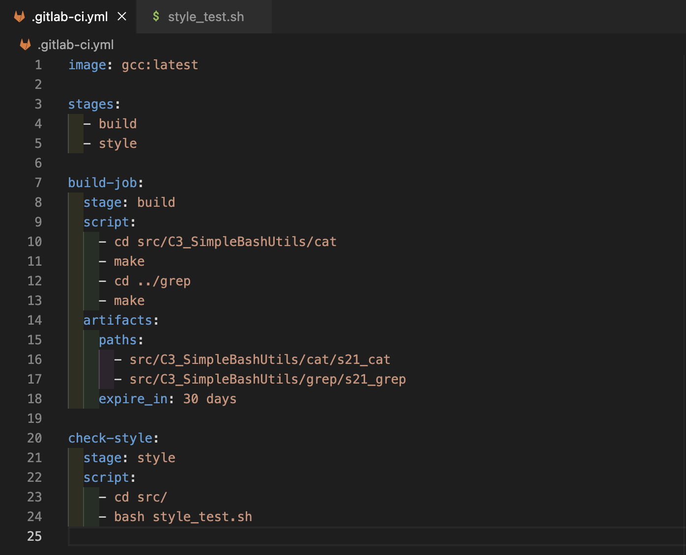

3. Кодстайл успешно прошел
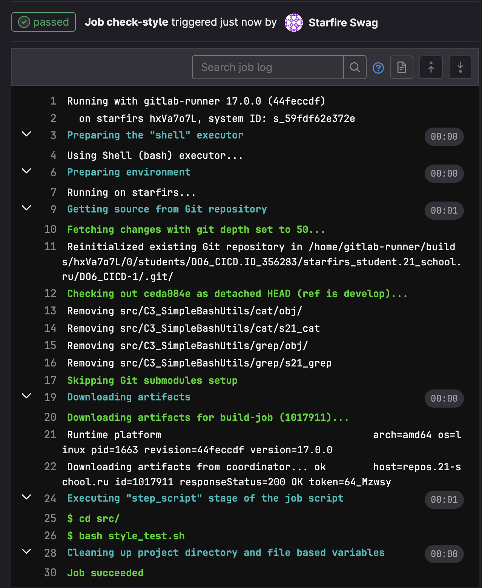

4. Кодстайл успешно провален
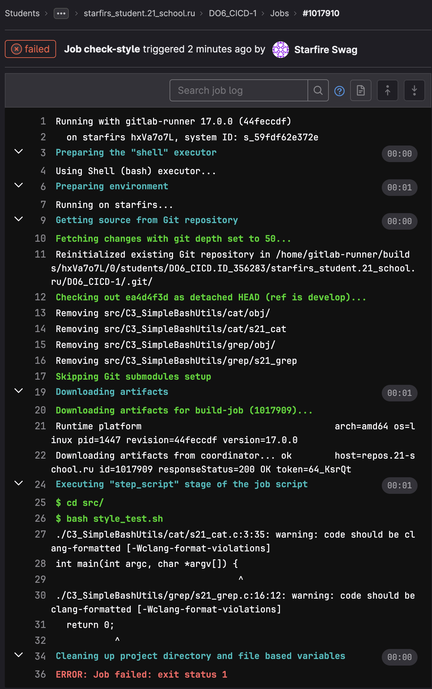

Part 4. Интеграционные тесты

1. Этап CI для теста
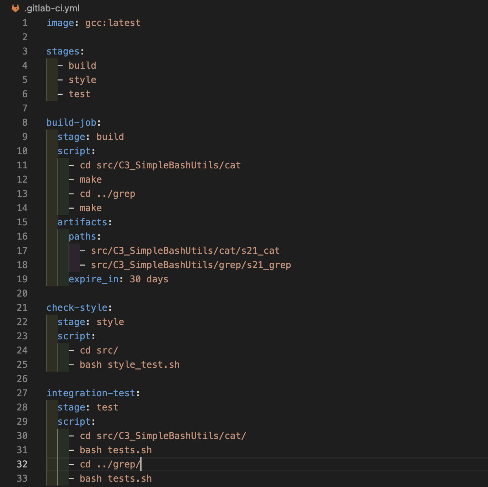

2. Выполненный результат
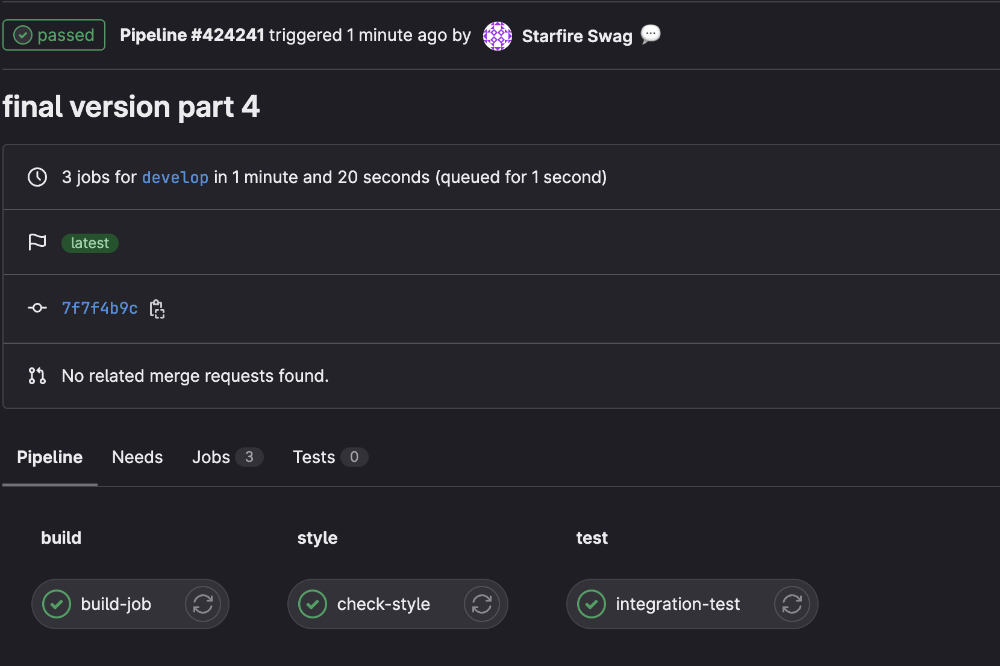

Part 5. Этап деплоя

1. Этап CD
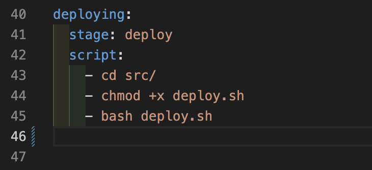

2. Скрипт для переноса испольняемого файла на второй сервер
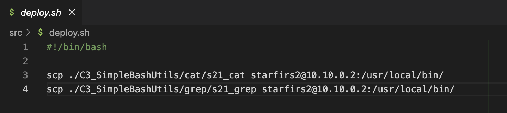

3. Результаты деплоя
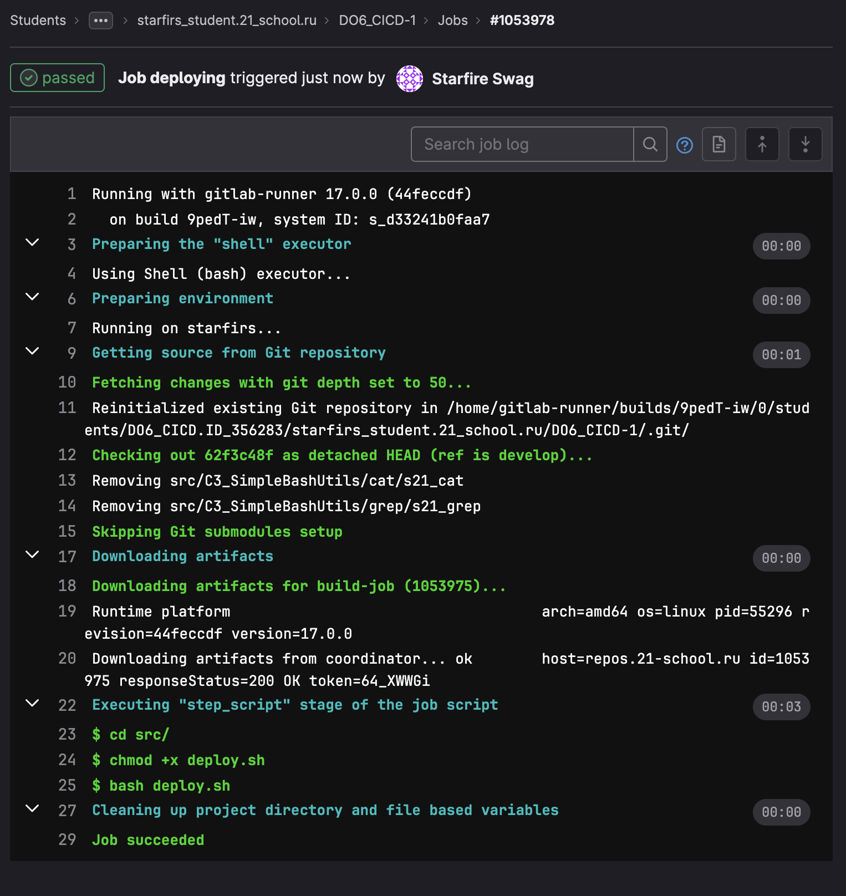
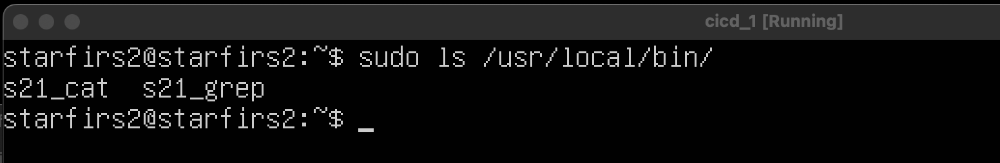

Part 6. Дополнительно. Уведомления

1. Для того чтобы он отправлял нам уведомление после каждого выполненного CICD немного изменил файл .gitlab-ci.yml
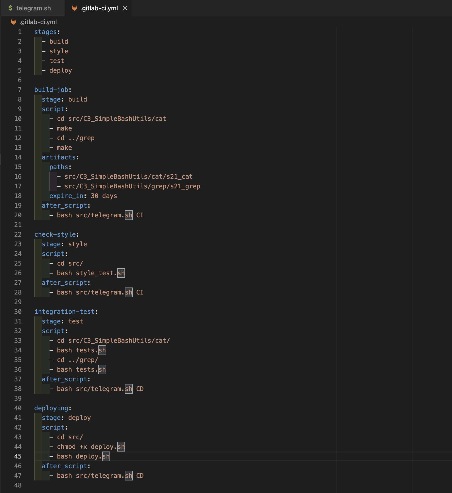

2. Написал bash скрипт для проверки результатов выполнения кода
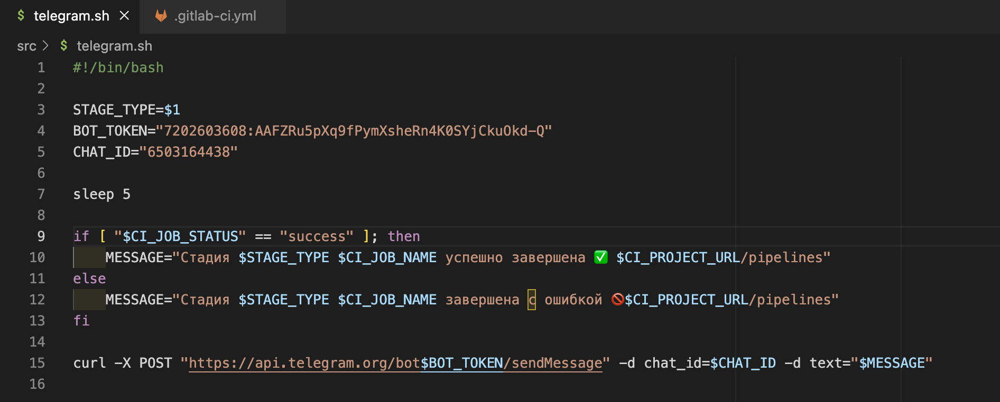

3. Результат уведомлений в телеграмм боте

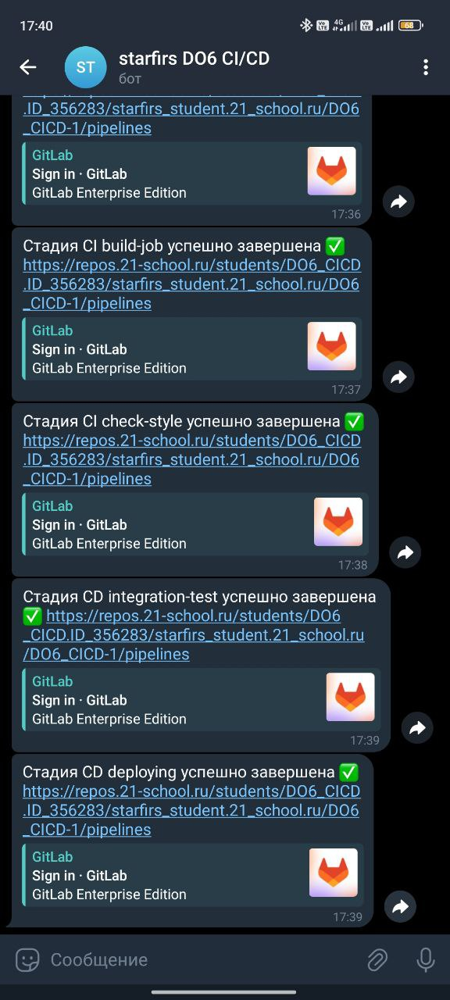
